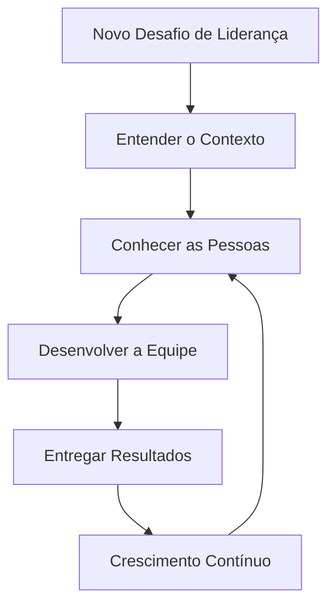

## O Convite que Carrega História

Recentemente, fui convidado para liderar uma equipe de desenvolvimento na FIA (Fundação Instituto de Administração). Tenho uma história complexa e longínqua com esta instituição — um lugar que sempre foi como uma casa para mim e minha família. Não poderia estar mais feliz com essa oportunidade.

## O Trabalho que Está por Vir

Tenho agora um desafio importante pela frente: entender onde e como exercer essa liderança da melhor forma possível. Mas, como sempre acreditei, **ser líder é mais do que dominar técnicas — é entender pessoas**. Tenho certeza de que essa perspectiva fará grande diferença na minha carreira.

## Grandes Responsabilidades, Grandes Poderes

Os desafios serão grandes. Mas se o axioma do Homem-Aranha nos ensina que "com grandes poderes vêm grandes responsabilidades", acredito que a relação seja bicondicional: **com grandes responsabilidades também devem vir grandes poderes** — a autonomia e a confiança necessárias para fazer acontecer.

## Seguindo em Frente

Vamos em frente para mais essa jornada de autoconhecimento e aprendizado contínuo. A FIA sempre me ofereceu isso de forma sublime, integral e grandiosa. Agora, é hora de retribuir liderando.
