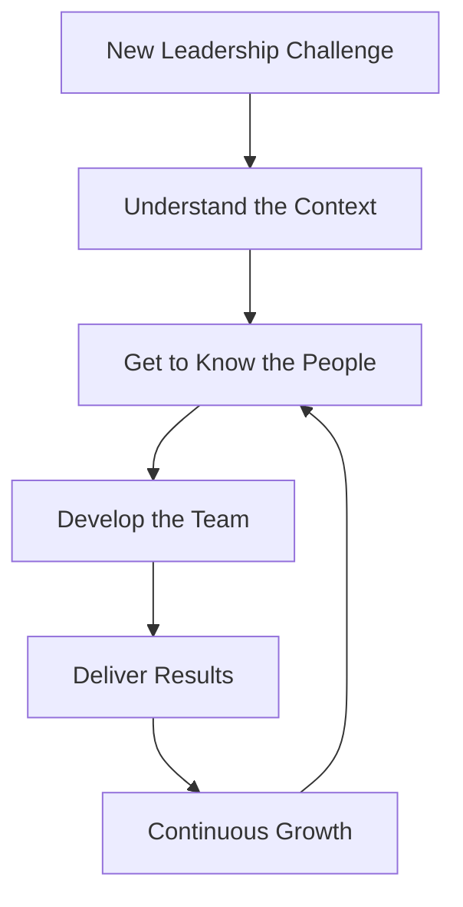

## An Invitation That Carries History

Recently, I was invited to lead a development team at FIA (Fundação Instituto de Administração). I have a long and meaningful history with this institution — a place that has always felt like home to me and my family. I couldn't be happier about this opportunity.

## The Work Ahead

I now face an important challenge: understanding where and how to exercise this leadership in the best way possible. But as I've always believed, **being a leader is more than mastering techniques — it's about understanding people**. I'm certain this perspective will make a real difference in my career.

## Great Responsibilities, Great Powers

The challenges will be significant. But if Spider-Man's axiom teaches us that "with great power comes great responsibility," I believe the relationship goes both ways: **with great responsibility must also come great power** — the autonomy and trust needed to make things happen.

## Moving Forward

Onward to another journey of self-discovery and continuous learning. FIA has always offered me this in a profound and meaningful way. Now it's time to give back by leading.
