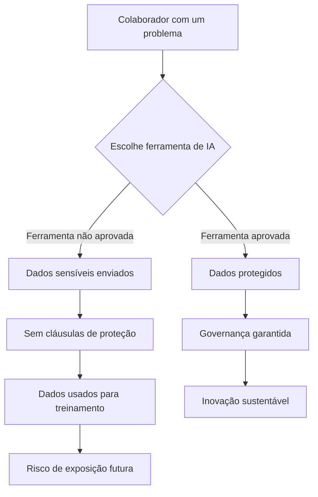

## O Desafio de Liderar na Era da IA Generativa

Liderar um time de desenvolvimento numa época em que todo mundo quer aplicar IA em tudo é um desafio enorme. Provas de conceito viram demandas de TI mais rápido do que você consegue dizer "planning da sprint". Muitas vezes, as pessoas resolvem seus próprios problemas usando ChatGPT gratuito, uma conta paga pessoal, ou até Claude Code para gerar mini aplicações, gráficos e análises de dados.

Essa democratização da IA é, em muitos aspectos, extraordinária. Mostra iniciativa, criatividade e um desejo genuíno de melhorar processos. Mas também cria um fenômeno de shadow IT turbinado — onde as ferramentas sendo usadas não são apenas softwares não aprovados, mas modelos potencialmente famintos por dados com termos de uso pouco claros.

## O Risco Invisível da Autonomia Sem Governança

Na FIA, estamos prestando muita atenção nesse cenário. Apoiamos essa atitude proativa e resolutiva dos nossos colaboradores — afinal, resolver problemas é exatamente o que queremos. No entanto, quando feita sem o devido cuidado, essa autonomia pode colocar em risco pessoas, privacidade e a própria instituição.

Um motor de IA sem cláusulas claras de uso de dados pode — e provavelmente vai — usar informações privadas para treinamento. Um prompt bem elaborado numa versão futura desse modelo poderia expor segredos institucionais e comprometer a privacidade dos nossos clientes, sejam empresas ou pessoas físicas.

### Os Custos Ocultos das Ferramentas "Gratuitas"

Quando alguém usa uma ferramenta de IA gratuita para fins de trabalho, o custo real não é zero — é apenas pago em outra moeda: dados. Considere o que acontece quando:

- **Registros de alunos** são colados num prompt para análise
- **Projeções financeiras** são compartilhadas para gerar resumos
- **Documentos estratégicos** são enviados para tradução ou formatação
- **Informações de clientes** são usadas para redigir comunicações personalizadas

Cada uma dessas ações, ainda que bem-intencionada, cria um rastro de dados que pode ser armazenado, analisado e incorporado ao treinamento de modelos futuros. A conveniência de hoje se torna a vulnerabilidade de amanhã.

## Nossa Nova Política de Uso de IA

Fui convidado para apresentar nossa nova política de uso de IA. Nela, vamos abordar não apenas os riscos e oportunidades, mas também as **ferramentas aprovadas** para uso institucional.

### Os Três Pilares da Nossa Abordagem

Nossa política se sustenta em três pilares fundamentais:

1. **Transparência**: Comunicação clara sobre quais ferramentas são aprovadas e por quê
2. **Capacitação**: Fornecer acesso a ferramentas de IA de nível corporativo com proteção adequada de dados
3. **Educação**: Treinar nossas equipes para reconhecer riscos e tomar decisões informadas

### O Que Queremos Comunicar

É essencial que todos venham conosco nessa jornada — que é nova para todos nós — mas que precisa ser trilhada com governança. E aqui está o ponto mais importante:

> **Governança não é freio. É plataforma.**

Uma plataforma para que os esforços que fazemos hoje gerem resultados duradouros e resilientes.

Pense assim: um carro de corrida sem freios não é mais rápido — é apenas mais perigoso. Os melhores pilotos sabem que freios não te deixam mais lento; eles permitem que você acelere nas curvas porque você pode confiar no seu controle. Governança funciona da mesma forma. Ela nos dá a confiança para acelerar a inovação porque sabemos que podemos navegar as curvas com segurança.

## Diretrizes Práticas para o Uso Diário

Para tornar a governança prática em vez de teórica, estabelecemos diretrizes claras:

| Cenário | Abordagem Aprovada |
|---------|--------------------|
| Redigir e-mails ou documentos | Usar ferramentas de IA aprovadas; nunca incluir dados pessoais |
| Análise de dados | Apenas com conjuntos de dados anonimizados em plataformas aprovadas |
| Geração de código | Apenas ferramentas aprovadas; sem algoritmos proprietários nos prompts |
| Conteúdo criativo | Ferramentas aprovadas; revisar outputs quanto à precisão |
| Informações sensíveis | Tratamento apenas humano; sem assistência de IA |

## Nossa Responsabilidade como Instituição de Ensino

Como instituição de ensino — e principalmente como escola de negócios — temos a responsabilidade de liderar esses esforços de uma forma que otimize processos e gere valor para todos.

Essa responsabilidade é dupla. Internamente, precisamos proteger nossa comunidade — alunos, professores e funcionários — dos riscos da adoção descontrolada de IA. Externamente, temos a oportunidade de modelar como é uma governança responsável de IA para as organizações que nossos alunos liderarão amanhã.

### Liderando pelo Exemplo

Quando nossos alunos de MBA entrarem no mercado de trabalho e enfrentarem desafios semelhantes em suas organizações, eles levarão consigo os frameworks e mentalidades que demonstramos hoje. Se tratarmos governança como fricção burocrática, eles também tratarão. Se a abraçarmos como vantagem competitiva, eles levarão essa lição para salas de reunião por todo o país.

## Olhando para o Futuro

Estou muito animado com essa jornada. É uma oportunidade única de mostrar que inovação responsável não é uma contradição — na verdade, é a única forma de inovação que dura.

As organizações que vão prosperar na era da IA não serão aquelas que adotaram mais rápido ou de forma mais irresponsável. Serão aquelas que construíram fundações sustentáveis — que entenderam que o objetivo não é usar IA em todo lugar, mas usá-la bem onde importa.

Na FIA, estamos construindo essa fundação. E estamos convidando todos a construí-la conosco.
