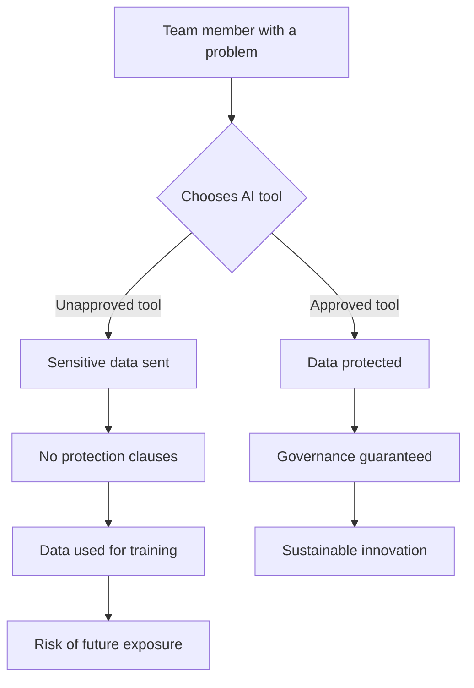

## The Challenge of Leading in the Generative AI Era

Leading a development team at a time when everyone wants to apply AI to everything is a massive challenge. Proofs of concept turn into IT requests faster than you can say "sprint planning." Often, people solve their own problems using free ChatGPT, a personal paid account, or even Claude Code to generate mini applications, charts, and data analyses.

This democratization of AI is, in many ways, extraordinary. It shows initiative, creativity, and a genuine desire to improve processes. But it also creates a shadow IT phenomenon on steroids — where the tools being used aren't just unapproved software, but potentially data-hungry models with unclear terms of service.

## The Invisible Risk of Autonomy Without Governance

At FIA, we're paying close attention to this scenario. We support this proactive, problem-solving attitude from our team members — after all, solving problems is exactly what we want. However, when done without proper care, this autonomy can put people, privacy, and the institution itself at risk.

An AI engine without clear data usage clauses can — and probably will — use private information for training. A well-crafted prompt in a future version of that model could expose institutional secrets and compromise the privacy of our clients, whether they're companies or individuals.

### The Hidden Costs of "Free" Tools

When someone uses a free AI tool for work purposes, the true cost isn't zero — it's just paid in a different currency: data. Consider what happens when:

- **Student records** are pasted into a prompt for analysis
- **Financial projections** are shared to generate summaries
- **Strategic documents** are uploaded for translation or formatting
- **Client information** is used to draft personalized communications

Each of these actions, while well-intentioned, creates a data trail that may be stored, analyzed, and incorporated into future model training. The convenience of today becomes the vulnerability of tomorrow.

## Our New AI Usage Policy

I was invited to present our new AI usage policy. In it, we'll cover not just the risks and opportunities, but also the **approved tools** for institutional use.

### The Three Pillars of Our Approach

Our policy rests on three fundamental pillars:

1. **Transparency**: Clear communication about which tools are approved and why
2. **Enablement**: Providing access to enterprise-grade AI tools with proper data protection
3. **Education**: Training our teams to recognize risks and make informed decisions

### What We Want to Communicate

It's essential that everyone joins us on this journey — which is new for all of us — but one that must be traveled with governance. And here's the most important point:

> **Governance isn't a brake. It's a platform.**

A platform so that the efforts we make today yield lasting, resilient results.

Think of it this way: a race car without brakes isn't faster — it's just more dangerous. The best drivers know that brakes don't slow you down; they let you go faster in the curves because you can trust your control. Governance works the same way. It gives us the confidence to accelerate innovation because we know we can navigate the turns safely.

## Practical Guidelines for Daily Use

To make governance practical rather than theoretical, we've established clear guidelines:

| Scenario | Approved Approach |
|----------|-------------------|
| Drafting emails or documents | Use approved AI tools; never include personal data |
| Data analysis | Only with anonymized datasets in approved platforms |
| Code generation | Approved tools only; no proprietary algorithms in prompts |
| Creative content | Approved tools; review outputs for accuracy |
| Sensitive information | Human-only handling; no AI assistance |

## Our Responsibility as an Educational Institution

As an educational institution — and primarily as a business school — we have the responsibility to lead these efforts in a way that optimizes processes and generates value for everyone.

This responsibility is twofold. Internally, we must protect our community — students, faculty, and staff — from the risks of uncontrolled AI adoption. Externally, we have the opportunity to model what responsible AI governance looks like for the organizations our students will lead tomorrow.

### Leading by Example

When our MBA students enter the workforce and face similar challenges in their organizations, they'll carry with them the frameworks and mindsets we demonstrate today. If we treat governance as bureaucratic friction, so will they. If we embrace it as a competitive advantage, they'll take that lesson into boardrooms across the country.

## Looking Ahead

I'm very excited about this journey. It's a unique opportunity to show that responsible innovation isn't a contradiction — it's actually the only form of innovation that lasts.

The organizations that will thrive in the AI era won't be those who adopted fastest or most recklessly. They'll be the ones who built sustainable foundations — who understood that the goal isn't to use AI everywhere, but to use it well where it matters.

At FIA, we're building that foundation. And we're inviting everyone to build it with us.